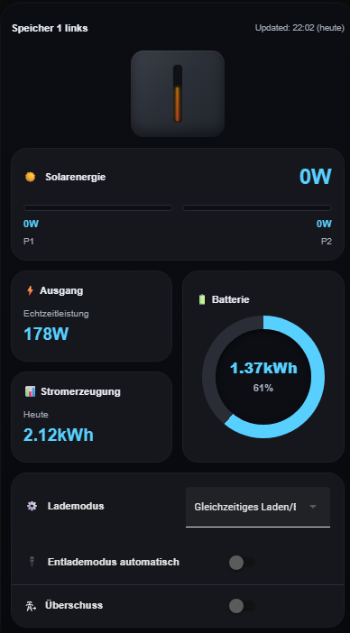
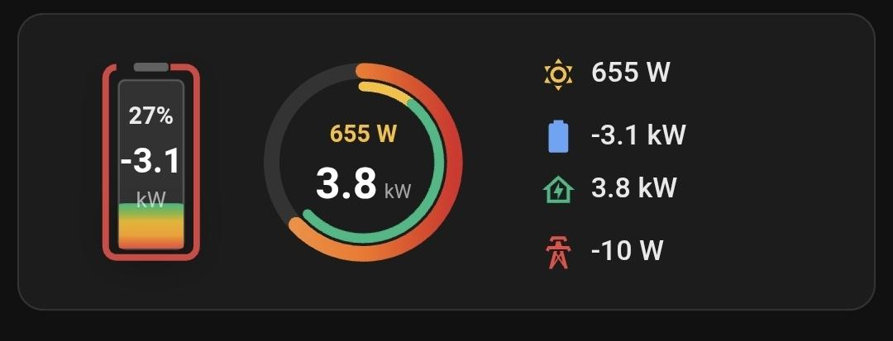
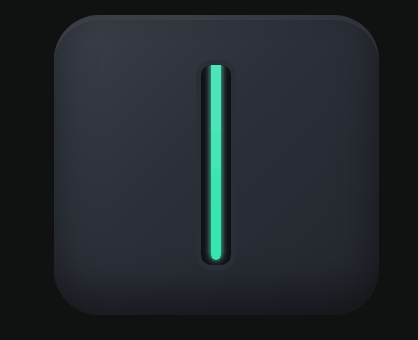
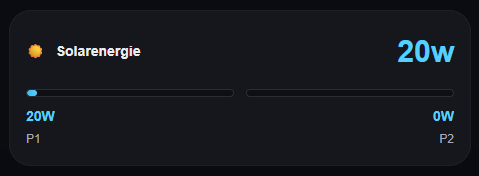
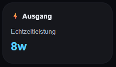
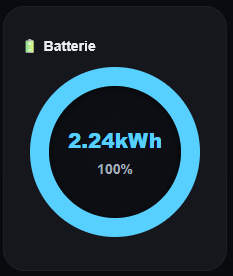
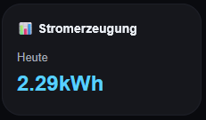
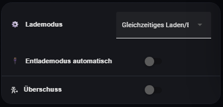
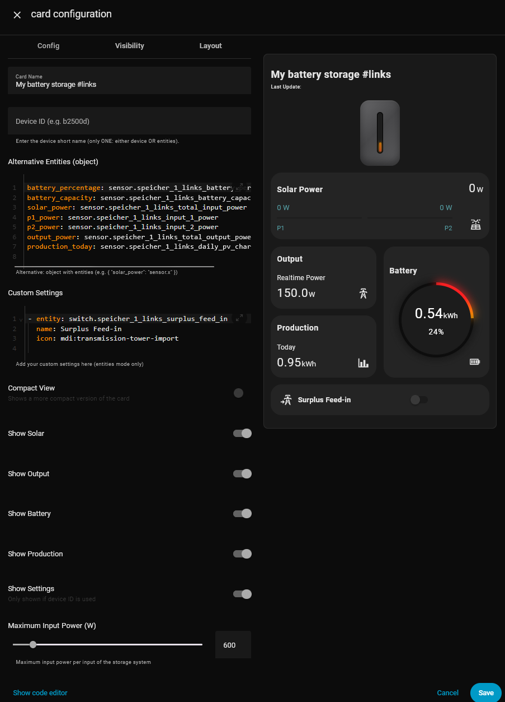

[![hacs][hacs-default]][hacs-default-link] [![hacs][hacs-validate]][hacs-validate-link]


# B2500D-Card | The Solar Storage Card

A Home Assistant Custom Card for the Marstek B2500d storage system.

Since you can also define individual entities and options, this card is suitable for other storage systems as well!

<u>Large Card:</u>



<u>Compact Card:</u>



## 🚀 Features
Inspired by the Marstek app, this custom card displays the values of your B2500d storage system – or, optionally, if the corresponding entities are available, any other storage system.

### 💡 Status Visualization

The card displays the current charging/discharging status at the top.  
The status also shows the current battery level in %.

| Status     | Meaning                          |
|------------|----------------------------------|
|   | Battery is neither charging nor discharging. |
|    | Battery is charging (solar power available and greater than output power, battery not full). |
|    | Battery is discharging (output power greater than input power, battery > 0%). |

### Cards

The following values/cards can currently be displayed:

#### Large Card

1. Current solar power total and input 1 & input 2
   


2. Current total output power



3. Battery level / capacity



4. Daily power generation



You can also configure the following modes:

1. Charging mode (simultaneous charge/discharge vs. full charge before discharge)  
2. Discharge mode (auto/manual)  
3. Surplus feed-in (on/off)  



Each of these cards can optionally be hidden (see section *Parameters*).  

Note: The settings card is hidden by default when using *entities mode*.

#### Compact Card
This card cannot be customized.


## ⚙️ Installation

### Optional Dependencies
Optionally, the b2500d-card works best with a device provided by this add-on:

- [hm2mqtt by @tomquist](https://github.com/tomquist/hm2mqtt)  

This way, you can easily pass the whole device, as the card uses the standard entities.  
For this, use the `device` parameter.  

If entities have been renamed, this method won’t work. You can still pass individual entities manually (see *Parameters* section).

### HACS
#### Community Store
The card is available in HACS (Home Assistant Community Store).

[](https://my.home-assistant.io/redirect/hacs_repository/?owner=Neisi&repository=B2500D-Card)

#### Custom Repositories
1. Open HACS  
2. Frontend → top right menu → Custom Repositories → `Neisi/b2500d-card`  
3. Select type: Dashboard  
4. Install  

### Manual Installation (without HACS)
1. Copy `b2500d-card.js` to `/config/www/`  
2. Add it in Lovelace:  
```yaml
resources:
  - url: /local/b2500d-card.js
    type: module
```

### 🛠️ Parameters

Here are the available parameters for this Lovelace card.

### 🔒 Required Parameters
You **must provide exactly one** of the following parameters:  

| Name       | Type   | Description |
|------------|--------|-------------|
| `device`   | string | The name of your device. Example: if the sensor for battery percentage is `sensor.speicher_1_links_battery_percentage`, then `<speicher_1_links>` is the device name. |
| `entities` | object | A collection of individual entities if you don’t want to provide a full `device`. In this mode, the settings card is hidden automatically. |

---

### 📦 `entities` Object

If you provide individual entities instead of `device`, the object looks like this:  

| Key                   | Type   | Description |
|------------------------|--------|-------------|
| `battery_percentage`   | string | Battery charge sensor (%) |
| `battery_capacity`     | string | Available battery capacity (Wh) |
| `solar_power`          | string | Total solar power sensor |
| `p1_power`             | string | PV string 1 sensor |
| `p2_power`             | string | PV string 2 sensor |
| `output_power`         | string | Total output power sensor |
| `production_today`     | string | Daily PV generation sensor (Wh) |

---
You don’t have to provide all entities. Missing entities are automatically set to 0.  
For the compact card, it’s enough to provide e.g. `battery_percentage`, `solar_power`, and `output_power`.

### 🧩 Optional Parameters

| Name            | Type    | Description                                               | Default |
|-----------------|---------|-----------------------------------------------------------|---------|
| `name`          | string  | Display name of your storage system (shown top left)      | Device name (e.g. `speicher_1_links`) |
| `output`        | boolean | Show output power card                                    | `true` |
| `battery`       | boolean | Show battery card                                         | `true` |
| `production`    | boolean | Show production card                                      | `true` |
| `settings`      | boolean | Show settings card                                        | `true` |
| `solar`         | boolean | Show solar card                                           | `true` |
| `compact`       | boolean | Show compact version                                      | `false` |
| `max_input_power` | number | Maximum input power per input (W), for scaling P1/P2 bars | `600` |

### 📘 Configuration

The card can be configured either with the code editor or (since v1.4.0) with the visual editor.

#### Manual Configuration with Code Editor
##### With Device
Add the complete card to your dashboard:
```yaml
type: custom:b2500d-card
device: speicher_2_rechts
name: Storage 2 right
```

Hide settings:
```yaml
type: custom:b2500d-card
device: speicher_2_rechts
name: Storage 2 right
settings: false
```

Show only solar power:
```yaml
type: custom:b2500d-card
device: speicher_2_rechts
name: Storage 2 right
settings: false
output: false
production: false
battery: false
```

Show only status card:
```yaml
type: custom:b2500d-card
device: speicher_2_rechts
name: Storage 2 right
settings: false
output: false
production: false
battery: false
solar: false
```

Show compact card:
```yaml
type: custom:b2500d-card
device: speicher_1_links
name: Storage 1 left
compact: true
```

##### With Entities
Example using entities instead of `device`:
```yaml
type: custom:b2500d-card
entities:
  solar_power: sensor.my_storage_total_input_power
  battery_capacity: sensor.my_storage_battery_capacity
  ...
name: My Storage
```

#### Configuration with Visual Editor (since v1.4.0)
The configuration can also be done using the built-in form editor (visual editor).




<!--BADGES-->
[hacs-default]: https://img.shields.io/badge/HACS-Default-blue?style=flat&logo=homeassistantcommunitystore&logoSize=auto
[hacs-default-link]: https://my.home-assistant.io/redirect/hacs_repository/?owner=Neisi&repository=b2500d-card&category=plugin
[hacs-validate]: https://github.com/ngocjohn/lunar-phase-card/actions/workflows/validate.yaml/badge.svg
[hacs-validate-link]: https://github.com/Neisi/b2500d-card/actions/workflows/validate.yaml
