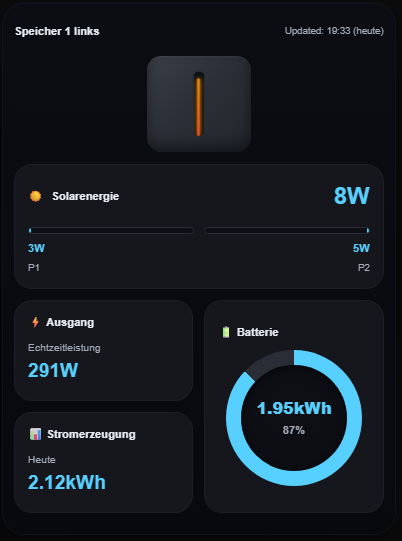
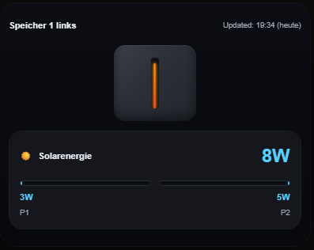
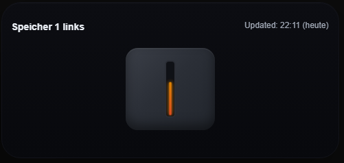

# B2500D-Card | Die Solarspeicher-Karte

Eine Home Assistand Custom Card für den Marstek B2500d Speicher.

Da man aber auch einzelne Entitäten und Optionen angeben kann, eignet sich diese Karte auch für andere Speicher!

<u>Große Karte:</u>


<u>Kompakte Karte:</u>


## 🚀 Features
Angelehnt an die Marstek App, zeigt diese Custom Card die Werte deines B2500d Speichers an.

### 💡 Status Visualisierung

Die Karte visualisiert oben als erstes den aktuellen Lade/Entladestatus.
Status zeigt ebenfalls aktuellen Batterieladestand in %.

| Status     | Bedeutung                          |
|--------|------------------------------------|
|   | Batterie wird weder ge- noch entladen.              |
|     | Batterie wird geladen (Solarenergie vorhanden und größer als Ausgangsleistung. Batterie nicht voll) |
|      | Batterie wird entladen (Ausgangsleistung größer Eingangsleistung. Batterie größer 0%)      |


### Karten

Aktuell können folgende Werte bzw. Karten angezeigt werden: 

#### Große Karte

1. Aktuelle Solarenergie gesamt und Eingang 1 & Eingang 2
   


2. Aktuelle Ausgangsleistung gesamt


3. Batterie Ladestand / Kapazität


4. Tages Stromerzeugung


Aktuell können folgende Modi eingestellt/umgestellt bzw. angezeigt werden

1. Lademodus (gleichzeitiges laden/entladen vs. vollständig laden und dann entladen)
2. Entlademodus (auto/manuell)
3. Überschusseinspeisung (an/aus)


Wobei jede dieser einzelnen Karten auch optional ausgeblendet werden können, siehe Abschnitt Parameter

Hinweis: Die Einstellungskarte wird standardmäßig im Entitätsmodus ausgeblendet!

#### Kompakte Karte
Diese Karte lässt sich nicht anpassen


## ⚙️ Installation

### Optionale Abhängigkeiten
Optional: Die b2500d-card verwendet man am einfachsten mit einem Gerät was von folgendem Addon stammt:

- [hm2mqtt von @tomquist](https://github.com/tomquist/hm2mqtt) 

So kann man einfach das ganze Device übergeben. Die Card nutzt die Standard Entities. 
Hierfür nutzt du bitte den Parameter device.

Wurden die Entitäten umbenannt funktioniert dieser einfache Weg nicht mehr. Du kannst trotzdem dann einzelne Entitäten übergeben. Bitte schaue dir den Abschnitt Parameter an.


### HACS
#### Community Store
Die Karte ist im HACS (Home Assistant Community Store) verfügbar.

[](https://my.home-assistant.io/redirect/hacs_repository/?owner=Neisi&repository=B2500D-Card)


####  Benutzerdefinierte Repositories
1. HACS öffnen
2. Frontend → oben rechts auf die drei Punkte → Custom Repositories / Benutzerdefinierte Repositories → `Neisi/b2500d-card`
3. Typ Dashboard
4. Installieren

### Manuelle Installation ohne HACS
1. `b2500d-card.js` nach `/config/www/` kopieren
2. In Lovelace hinzufügen:
```yaml
resources:
  - url: /local/b2500d-card.js
    type: module
```
### 🛠️ Parameter

Hier sind die verfügbaren Parameter für diese Lovelace Card beschrieben.

### 🔒 Erforderliche Parameter
Du **musst genau einen** der folgenden Parameter angeben:  

| Name       | Typ    | Beschreibung                                                                 |
|------------|--------|------------------------------------------------------------------------------|
| `device`   | string | Der Name deines Geräts. Heißt z.B. der Sensor für die aktuelle Batterie "sensor.speicher_1_links_battery_percentage" ist <speicher_1_links> der Name des Geräts. |
| `entities` | object | Sammlung einzelner Entitäten, falls du kein komplettes `device` übergeben möchtest. Siehe unten. In diesem Modus wird automatisch die Einstellungskarte ausgeblendet |

---

### 📦 `entities` Objekt

Wenn du statt `device` einzelne Entitäten angibst, sieht das Objekt so aus:  

| Schlüssel              | Typ    | Beschreibung |
|-------------------------|--------|--------------|
| `battery_percentage`    | string | Sensor für Batterieladung in % |
| `battery_capacity`      | string | Sensor für verfügbare Batteriekapazität (in Wh) |
| `solar_power`     | string | Sensor für gesamte Solarleistung |
| `p1_power`         | string | Sensor für PV-String 1 |
| `p2_power`         | string | Sensor für PV-String 2 |
| `output_power`    | string | Sensor für Gesamt-Ausgangsleistung |
| `production_today`     | string | Sensor für die tägliche PV-Erzeugung (in Wh) |

---
Du musst nicht zwingend alle Entitäten angeben. Entitäten die du nicht übergibst sind automatisch 0. Für die kompakte Karte reicht es z.B. aus `battery_percentage`, `solar_power` und `output_power` anzugeben.

### 🧩 Optionale Parameter

| Name           | Typ      | Beschreibung                                               | Standardwert     |
|----------------|----------|------------------------------------------------------------|------------------|
| `name`        | string   | Wie heißt dein Speicher ? Der Name wird oben links in der Karte angezeigt        | Std. Gerätename (also z.B. `speicher_1_links`           |
| `output`    | boolean  | Legt fest, ob die Karte Ausgangsleistung angezeigt werden soll            | `true`           |
| `battery`         | boolean   | Legt fest, ob die Karte Batterie angezeigt werden soll                            | `true`|
| `production`         | boolean   | Legt fest, ob die Karte Stromerzeugung angezeigt werden soll            | `true`      |
| `settings`        | boolean   | Legt fest, ob die Karte Einstellungen angezeigt werden soll              | `true`|
| `solar`        | boolean   | Legt fest, ob die Karte Solarenergie angezeigt werden soll             | `true`|
| `compact`        | boolean   | Zeigt die kompakte Variante an             | `false`|
| `max_input_power`        | number   | Maximalleistung in W pro Eingang (Skalierung der Balkenanzeige P1 und P2)             | `600` |

### 📘 Konfiguration

Die Karte kann entweder mit dem Code-Editor oder mit dem visuellen Editor (ab v.1.4.0) konfiguriert werden.

#### Manuelle Konfiguration mit dem Code-Editor
#### Mit Device

Füge die komplette Karte ganz einfach in dein Dashboard ein
```yaml
type: custom:b2500d-card
device: speicher_2_rechts
name: Speicher 2 rechts
```

Karte Einstellungen ausblenden:
```yaml
type: custom:b2500d-card
device: speicher_2_rechts
name: Speicher 2 rechts
settings: false
```


Zeigt nur die Karte Solarenergie an:
```yaml
type: custom:b2500d-card
device: speicher_2_rechts
name: Speicher 2 rechts
settings: false
output: false
production: false
battery: false
```


Zeigt nur die Status Karte an:
```yaml
type: custom:b2500d-card
device: speicher_2_rechts
name: Speicher 2 rechts
settings: false
output: false
production: false
battery: false
solar: false
```


Zeigt die kompakte Karte an:
```yaml
type: custom:b2500d-card
device: speicher_1_links
name: Speicher 1 links
compact: true
```


#### Mit Entitäten

Beispiel mit Entitäten statt device
```yaml
type: custom:b2500d-card
entities:
  solar_power: sensor.mein_speicher_total_input_power
  battery_capacity: sensor.mein_speicher_battery_capacity
  ......
name: Mein Speicher
```

#### Konfiguration mit dem visuellen Editor (ab v1.4.0)

Die Konfiguration kann auch mit dem Built-In-Form-Editor (visueller Editor) vorgenommen werden.


